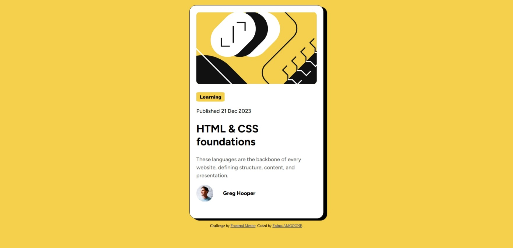
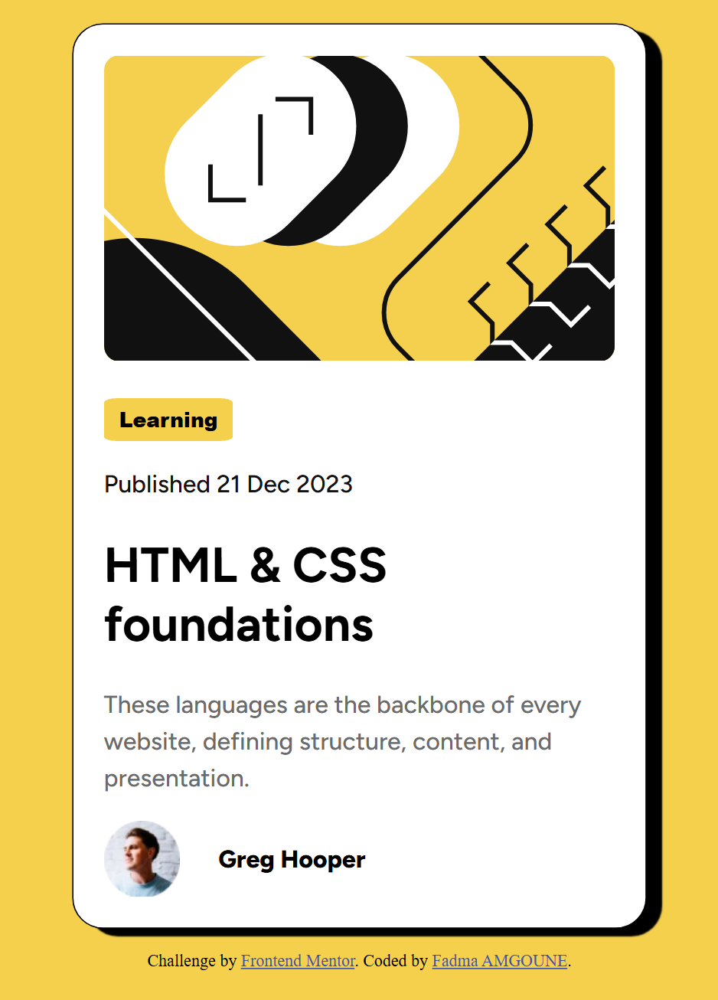
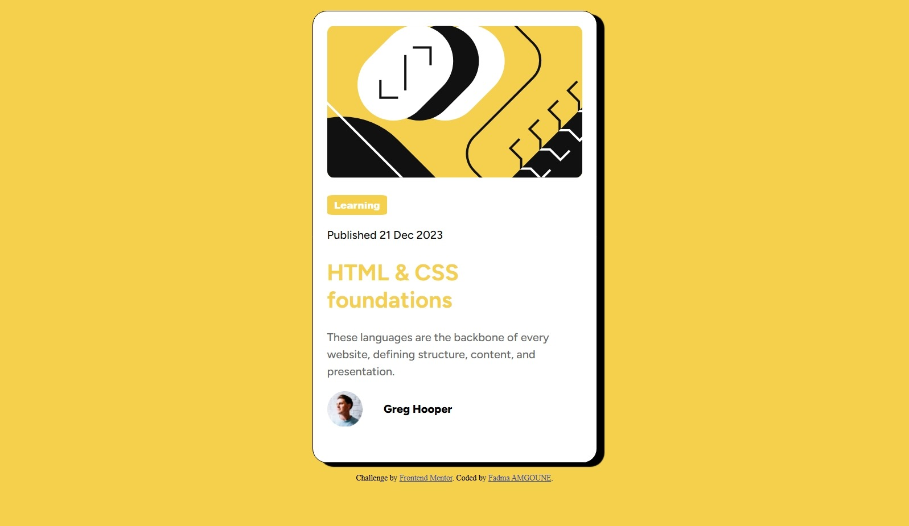

# Frontend Mentor - Blog preview card Solution

This is a solution to the Blog Preview Card challenge on Frontend Mentor. The goal of this project was to build a responsive blog preview card and practice fundamental HTML and CSS skills.

## Table of contents

* [Overview](#overview)

  * [The challenge](#the-challenge)
  * [Screenshot](#screenshot)
  * [Links](#links)
* [My process](#my-process)

  * [Built with](#built-with)
  * [What I learned](#what-i-learned)
  * [Continued development](#continued-development)
  * [AI Collaboration](#ai-collaboration)
* [Author](#author)

## Overview

### The challenge

Users should be able to:

* View the blog card on different screen sizes
* See hover and active states for all interactive elements

### Screenshot





### Links

* [Solution URL: ](https://github.com/fadmaamgoune/Frontend-Mentor---Social-Links-Profile-Solution)
* [Live Site URL: ](https://fadmaamgoune.github.io/Frontend-Mentor---Social-Links-Profile-Solution/)

## My process

### Built with

* Semantic HTML5
* CSS3
* Flexbox
* Mobile-first workflow
* GitHub
* GitHub Pages

### What I learned

During this project I practiced:

* Structuring a webpage using semantic HTML
* Using Flexbox for layout and alignment
* Styling profile images with `border-radius`
* Creating hover and active states for buttons
* Deploying a project with GitHub Pages
* Using browser developer tools to debug CSS issues

Example of a hover effect used in the project:

```css
button:hover {
  cursor: pointer;
}
```

### Continued development

In future projects I want to focus on:

* Improving responsive design skills
* Becoming more comfortable with CSS Grid
* Writing cleaner and more maintainable CSS
* Learning JavaScript to create interactive web pages

### AI Collaboration

I used ChatGPT during this project to:

* Understand CSS concepts
* Debug layout and styling issues
* Learn how to use GitHub Pages
* Improve my understanding of Flexbox and responsive design

The AI was especially useful for explaining concepts step by step and helping me solve styling problems independently.

## Author

* Frontend Mentor - [@fadmaamgoune](https://www.frontendmentor.io/profile/fadmaamgoune)
* GitHub - [fadmaamgoune](https://github.com/fadmaamgoune)

